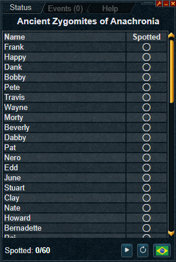
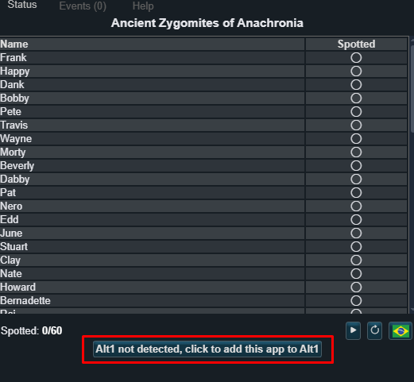

# Anachronia Zygomite Tracker (Alt1)

Track the Ancient Zygomites on RS3 automatically via Alt1. Click Start, talk to NPCs, and the app marks what you’ve found. You can also toggle items manually.

  
   
  <em>Example UI</em>
  

## How to use
- [Click to install this app to your alt1](alt1://addapp/https://wyvern800.github.io/AncientZygomitesTracker/appconfig.json/), or open the live app link: [View live app](https://wyvern800.github.io/AncientZygomitesTracker/),  or click “Add App”. Accept the needed permissions. Or just add the app manually

    
   <em>Click on the button to add the plugin to your alt1</em>

- Start with the play button; keep the NPC chatbox visible.
- Rows toggle on click if you want to mark/unmark manually.
- Events tab shows the recent detections.

Mandatory: make sure to set the game language to English .

## Dev
- Build: `npm run build`
- Watch: `npm run watch`

License: MIT-like, provided as-is.
